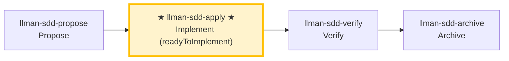

# LLMAN SDD Apply

Implement all tasks in `llmanspec/changes/<id>/tasks.md` **in one closed loop**:
Implement code → Add tests/acceptance → Run gates → Self-heal on failures → Report results when all pass.
Unless there is a clear blocker, **DO NOT stop halfway to ask "should I continue?"**

## Pipeline Position

## Git-native lifecycle (brief)

Do not conflate **skill navigation** with the **Git-native lifecycle**. Full diagram: root `AGENTS.md` or the diagram inside `llman-sdd-propose`.

Hard rules:
1. **First** Branch binding (`change start` / `attach`) → Full; **then** Specs landing (edit and commit `llmanspec/specs/**` on the bound branch).
2. No live contract edits → `skip_specs_landing: true`. Apply requires `readyToImplement=true`.
3. **Do not** commit live specs on the default branch; if already attached, do not re-run `start`.

### Skill navigation (not the lifecycle; shows current skill only)



> 📍 You are at Git-native **H (apply)** in the full lifecycle diagram: Specs-landed (or `skip_specs_landing`) and `readyToImplement=true` required first → next: `llman-sdd-verify`

## Hard Constraints

- **SSOT-driven**: `proposal.md` / `design.md` / `tasks.md` and live `llmanspec/specs/**` on the feature branch are the single source of truth; every MUST/SHALL in specs must be fulfilled.
- **Scope-locked**: Only implement what's in the current change; don't fix "unrelated issues" on the side.
- **Minimal changes**: Keep changes minimal and strictly scoped to current tasks.
- **No guessing**: If requirements are unclear, or specs contradict reality, STOP and report — don't assume behavior.
- **No legacy compatibility layers**: If a change requires new behavior, upgrade all call sites directly, unless tasks/proposal explicitly require compatibility.
- **Don't ask "should I continue?"**: Execute to loop closure unless you hit an unresolvable blocker.
- **Close-out**: this skill's closed loop ends by suggesting `llman-sdd-verify`; finalize/archive is handled by `llman-sdd-archive` (do not finalize inside the self-healing loop).

## Steps

### 0) Preflight (required)
- Read and obey: `llmanspec/config.yaml`, `AGENTS.md` (if present).
- `git status --porcelain`:
  - If working tree is dirty and changes don't belong to the current change: `git stash push -u -m "llman-sdd-apply autopilot backup"`.
- Run `llman sdd validate --all --strict --no-interactive`:
  - If it fails for reasons unrelated to the current change, stop and report (inconsistent artifacts prevent SSOT-driven implementation).
- **Check spec valid_scope integrity**: use `llman sdd list --specs --json` to list all specs, then for each spec verify every path in its `valid_scope` exists on disk. If any scope file/directory is missing, stop and suggest updating the spec (remove the deleted path from `valid_scope`).

### 1) Select change id and check prerequisites
- If a change id is provided, use it directly.
- Otherwise infer from context; if ambiguous, run `llman sdd list --json` and let user pick.
- Always announce: "Using change: <id>" and how to override.
- Confirm you are on the non-default feature branch bound via `llman sdd change start <id>` or `change attach <id>` (`--force` only to rebind). Specs/features on the branch are SSOT — do not author under `changes/<id>/specs/`.
## Stage guard (`stage` / `readyToImplement`)

Decide from authoritative JSON (never from vague "complete artifacts" wording):

```bash
llman sdd show <id> --json --type change
```

Read: `stage`, `specsLanded`, `skipSpecsLanding`, `readyToImplement`.

| Condition | Action |
|-----------|--------|
| `stage=draft` (proposal.md only) | STOP. Grow to Designed (proposal + tasks; design as needed) → Branch binding → Specs landing. Draft cannot apply/verify. If proposal+design+tasks exist but stage is still `draft`: not started/attached — run `change start` on a clean default branch, or create a branch then `change attach`. **Do not** create `changes/<id>/specs/`; **do not** edit live specs on the default branch first. |
| `stage=designed` | STOP. Run `change start` / `attach` (Branch binding) first. |
| `stage=full` and `readyToImplement=false` | STOP. Finish Specs landing on the **bound branch** (edit `llmanspec/specs/**` and commit), or set `skip_specs_landing`. **Do not** re-run `change start`. If specs on the bound branch were lost → checkout/recreate + `attach --force` if needed. |
| `readyToImplement=true` | Pass apply/verify prerequisites. `changes/<id>/specs/` is expected to be **absent** — do not treat as missing. |
- Use `llman sdd context --task "<goal from proposal>" --paths "<scope from specs>"` to get relevant specs.
  - If context is unavailable, run `llman sdd index rebuild` and retry.

### 2) Read SSOT artifacts
You must read through:
- `llmanspec/changes/<id>/proposal.md`
- `llmanspec/changes/<id>/design.md` (if present)
- `llmanspec/changes/<id>/tasks.md`
- Live specs on the feature branch: `llmanspec/specs/**` (`<capability>.feature`) — this is SSOT

Extract hard constraints from proposal.md and design.md decisions. Convert tasks.md into a minimal executable step sequence (preserving original order).

### 3) Show status
- Progress: "N/M tasks complete"
- Next 1–3 unchecked tasks (brief overview)

### 4) Implement tasks one by one (closed-loop execution)
For each unchecked task:
1. **Implement**: strictly per task description + specs requirements, keep changes minimal.
2. **Update checkbox immediately** after completion: `- [ ]` → `- [x]`.
3. If task is unclear, you hit a blocker, or specs/design don't match reality → STOP and report the blocker, don't assume.

> 💡 Previous phase `llman-sdd-propose` (generated tasks); after this phase → `llman-sdd-verify` (verify)

### 5) Verification and self-healing loop (run after each task or batch)
Run project gate commands (adapt to the actual project):
- Relevant test suite: `just test` or `cargo test --all`
- Format/lint: `just check` or `just lint` + `just fmt`
- Git-native: stay on the bound feature branch; edit live `llmanspec/specs/<capability>/<capability>.feature` (rules `@human`, acceptance `@executable`) as needed; run `llman sdd validate --specs` after spec edits. Do not run `checkpoint` after every task. Do not use `change delta` / solidify / feature_delta.
- SDD validation: `llman sdd validate <id> --strict --no-interactive`

**On failure → enter self-healing loop (don't ask "should I continue?"):**
1. Parse failure cause (test failure / lint / format / validation error).
2. **Decide if it's a hard-to-locate bug** (cause unclear / intermittent flake / regression not obvious at a glance):
   - **Not hard-to-locate** (clear lint/format/compile/validation error): apply a minimum fix (don't expand scope); re-run the "minimum failure repro command" first, then re-run all gates.
   - **Hard-to-locate bug → escalate to the diagnose sub-flow**:
     1. **First build a command that reproduces the failure** (fast, deterministic, agent-runnable, and goes red on *this* bug) — one that drives the real bug path and asserts the user's exact symptom. **MUST NOT start hypothesizing before such a command exists** (staring at code and guessing is the failure this prevents).
     2. Run it, confirm red → minimize the repro (cut inputs/calls/config/data one at a time, keep only what's load-bearing).
     3. Generate **3–5 ranked hypotheses**, each falsifiable ("if X is the cause, changing Y makes the bug disappear").
     4. Verify one variable at a time; fix once the root cause is found.
     5. If there's no correct seam for a regression test, note the architectural gap (hand off to `llman-sdd-arch-review`).
3. Re-run the "minimum failure repro command" first, then re-run all gates.
4. Log as one self-healing round: `Round N: failure → fix → re-run → pass/fail`.

**Self-healing cap: 8 rounds**; exceeding this is a blocker: stop and output a blocker report (last failing command + output summary + what you tried).

### 6) Completion report
After all tasks complete + all gates green, output a structured report (see Output Contract below).
Then suggest running `llman-sdd-verify` for the verification phase.

> 💡 Implementation done → next: `llman-sdd-verify` (verify)

Before acting, read `llmanspec/config.yaml` and follow its `context` and `rules` if present.

Common commands:
- `llman sdd context --task "<description>" --paths "<files>"` (find relevant specs). Uses the pageindex agentic tree backend (needs `LLMAN_SDD_INDEX_CHAT_MODEL`). Preset via `LLMAN_SDD_INDEX_BACKEND`.
- `llman sdd list` (list changes)
- `llman sdd list --specs` (list specs with purpose/scope metadata)
- `llman sdd show <id>` (show change/spec; `--type change --output json` includes `stage` / `specsLanded` / `skipSpecsLanding` / `readyToImplement` — apply gate is `readyToImplement`, not vague "complete artifacts")
- `llman sdd validate <id>` (validate a change or spec)
- `llman sdd validate --all` (bulk validate)
- `llman sdd index rebuild` (rebuild the pageindex tree index — no model needed)
- `llman sdd index check` (check index freshness)
- `llman sdd change new <id>` (create planning-shell draft `changes/<id>/proposal.md` only; does not write live specs)
- `llman sdd change start <id> [--worktree]` (Designed→Full: clean tree on default branch → create `sdd/<id>` + attach; Branch binding only — not Specs landing, not apply-ready)
- `llman sdd change attach <id> [--force]` (bind an existing non-default feature branch + base SHA; rejects the default branch)
- `llman sdd change finalize <id> [--no-check]` (**recommended single-commit close-out** — after verify; dirty tree OK; gates + auto ff-merge + docs rename)
- `llman sdd change checkpoint <id> [--no-check]` (clean tree + gates before archive; strict sha = HEAD; finalize fallback)
- `llman sdd change diff <id> [--export-patch <path>]` (read-only `base...HEAD` review/export)
- `llman sdd change archive <id>` (seal: auto ff-merge into default branch, then rename docs to `changes/archive/`; prefer `finalize` for single-commit close-out)
- `llman sdd archive freeze [--before YYYY-MM-DD] [--keep-recent N] [--dry-run]` (freeze archived dirs)
- `llman sdd archive thaw [--change <id> ...] [--dest <path>]` (restore from cold-backup)
- `llman sdd graph [CHANGE] [--format mermaid] [--scope active|archived|all] [--depth N]` (generate change dependency graph)
- `llman sdd project migrate --kind spec-md2toon` (`.md`+fence → standalone `.toon`; `partitioned` removed)

## Context
- Gather the current change/spec state before acting.
- Prefer `llman sdd context --task --paths` to discover relevant specs instead of guessing or full scans.

## Goal
- State the concrete outcome for this command/skill execution.

## Constraints
- Keep changes minimal and scoped.
- Avoid guessing when identifiers or intent are ambiguous.
- Use `llman sdd context --task --paths` before reading full spec files.
- Choose workflow path by change scale: behavioral contracts use full SDD (Branch binding → Specs landing → `readyToImplement` → apply); implementation changes use quick path (live specs still require a bound branch).
- Do not conflate skill navigation with the Git-native lifecycle; never edit live `llmanspec/specs/**` on the default branch.

## Workflow
- Use `llman sdd` commands as the source of truth.
- Validate outcomes when files or specs are updated.
- Prefer `llman sdd context` over full reads or guessing.
- When context is unavailable follow error guidance (rebuild index or fall back to `list --specs --json`).

## Decision Policy
- Ask for clarification when a high-impact ambiguity remains.
- Stop instead of forcing through known validation errors.

## Output Contract
- Summarize actions taken.
- Provide resulting paths and validation status.

## Ethics Governance
- `ethics.risk_level`: classify risk as `low|medium|high|critical`.
- `ethics.prohibited_actions`: list actions that MUST NOT be performed.
- `ethics.required_evidence`: list required evidence before high-impact output.
- `ethics.refusal_contract`: define when to refuse and safe alternative response.
- `ethics.escalation_policy`: define when to escalate to user confirmation/review.
