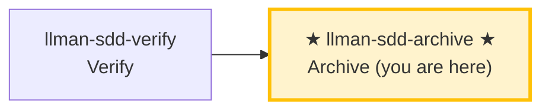

# LLMAN SDD Archive

Use this skill to archive completed changes. Prerequisites: verify all-green, and the change already has Branch binding plus Specs landing (or `skip_specs_landing`; live specs are on the bound branch). Archive/finalize **auto ff-merges** into the default branch, then **renames** change docs to `changes/archive/` (one follow-up `git commit` for the dirty rename). `git push` / hosting PR are optional.

## Pipeline Position



> 📍 You are in the archive phase: the last stop in the Git-native lifecycle.
> 📎 If specs get too large, run `llman-sdd-specs-compact` to compress.

## Hard Constraints

- **Must pass verify phase all-green first**: don't archive changes that haven't passed verification.
- **Must already have Branch binding**: `change start` / `attach` done; otherwise STOP.
- **SSOT validation**: every change must pass `llman sdd validate <id> --strict --no-interactive` before archiving.
- **Don't ask "should I continue?"**: execute the full batch to completion unless you hit an unresolvable error.
- **Close-out MUST NOT default to PR/push**: after archive/finalize, default to a local ff-merge (handled by the CLI) and one `git commit` for the docs rename. `git push` / hosting PR are optional — only when the user or project explicitly requires remote review. **Agent MUST NOT** push or open a PR by default on this skill's account.

## Steps

### 0) Preflight
- `git status --porcelain`: confirm working tree changes belong to completed changes.
- If unexpected changes exist, handle them (stash or report).

### 1) Confirm target changes
- Determine target IDs: single or batch (from user input or `llman sdd list --json`).
- Always announce: "Archiving IDs: <id1>, <id2>, ...".
- Confirm each change has passed verify phase all-green.

### 2) Archive one by one
- Validate each first: `llman sdd validate <id> --strict --no-interactive`.
- Validation failure → STOP and report; don't skip validation and force archive.
- Optional preview: `llman sdd change archive <id> --dry-run`.
- Execute archive:
  - default: `llman sdd change archive <id>`
  - tooling-only: `llman sdd change archive <id> --skip-specs`
  - **stop immediately on first failure**, report remaining unprocessed IDs.
- **Git-native close-out**:
  - Prerequisites: Branch binding done (`change start` / `attach`); still on the bound branch (or default branch after auto ff-merge).
  - `change archive` / `change finalize` run **auto ff-merge** (`git merge --ff-only <feature>` into default), **then** rename change docs into `changes/archive/` — rename is never rolled back on merge failure.
  - Legacy `*.feature.delta.toon` or `spec.toon` under specs is a migration blocker — run `llman sdd project migrate --kind toon2features`.
  - **Recommended: single-commit close (`change finalize`)** — same process runs gates → auto ff-merge → docs rename; leaves the tree dirty once for **one `git commit`**:
    ```text
    1. Implement live specs + code (working tree may stay dirty)
    2. llman sdd change finalize <id>   # gates + ff-merge + rename change docs
    3. git commit                       # one commit: impl + frontmatter + archive rename
    ```
    **`checkpoint_sha` semantics**: finalize writes attach-time `base_sha`, not the implementation HEAD (under single-commit mode that commit has not happened yet). For a strict implementation SHA, use the fallback below.
  - **Fallback: multi-commit sequence (`checkpoint` + `archive`)** — when you need a strict `checkpoint_sha`, or want a mid-flight review snapshot:
    ```text
    1. git commit   # commit live specs + code (clean tree required for checkpoint)
    2. llman sdd change checkpoint <id>   # writes checkpointed / checkpoint_sha (implementation HEAD)
    3. git commit   # commit proposal.md checkpoint metadata
    4. llman sdd change archive <id>      # ff-merge + rename change docs
    5. git commit   # commit archive rename
    ```

### 3) Full validation
- After all archives complete: `llman sdd validate --all --strict --no-interactive`.
- Confirm post-archive spec artifacts are consistent.

### 4) Commit guidance
- Suggest commit message (format: `feat(sdd): archive <id1>, <id2> - <short summary>`), then `git add -A && git commit -m "..."` if not already committed.
- Optional: `git branch -d <feature>` after ff-merge. push / hosting PR only when the user or project explicitly requires remote review.
- If user requests auto-commit of the archive docs commit, execute and output commit hash.
- **Archived `depends_on`**: archive renames the change dir to `archive/YYYY-MM-DD-<id>`, but validate recognizes `depends_on` pointing to archived/frozen ids as INFO (not ERROR), so you do **not** need to manually update other changes' `depends_on` frontmatter after archive.

> 💡 Previous phase `llman-sdd-verify` (passed verification) → this phase completes the loop. If specs grow too large, run `llman-sdd-specs-compact`.

## Archive Cold Backup Guidance
- If archived directories are growing too large, use cold backup maintenance:
  - Preview freeze candidates: `llman sdd archive freeze --dry-run`
  - Freeze old archives: `llman sdd archive freeze --before <YYYY-MM-DD> --keep-recent <N>`
  - Restore when needed: `llman sdd archive thaw --change <YYYY-MM-DD-id>`
- Apply freeze/thaw only to dated archive directories (`YYYY-MM-DD-*`) and keep a small recent window unfrozen when possible.

Before acting, read `llmanspec/config.yaml` and follow its `context` and `rules` if present.

Common commands:
- `llman sdd context --task "<description>" --paths "<files>"` (find relevant specs). Uses the pageindex agentic tree backend (needs `LLMAN_SDD_INDEX_CHAT_MODEL`). Preset via `LLMAN_SDD_INDEX_BACKEND`.
- `llman sdd list` (list changes)
- `llman sdd list --specs` (list specs with purpose/scope metadata)
- `llman sdd show <id>` (show change/spec; `--type change --output json` includes `stage` / `specsLanded` / `skipSpecsLanding` / `readyToImplement` — apply gate is `readyToImplement`, not vague "complete artifacts")
- `llman sdd validate <id>` (validate a change or spec)
- `llman sdd validate --all` (bulk validate)
- `llman sdd index rebuild` (rebuild the pageindex tree index — no model needed)
- `llman sdd index check` (check index freshness)
- `llman sdd change new <id>` (create planning-shell draft `changes/<id>/proposal.md` only; does not write live specs)
- `llman sdd change start <id> [--worktree]` (Designed→Full: clean tree on default branch → create `sdd/<id>` + attach; Branch binding only — not Specs landing, not apply-ready)
- `llman sdd change attach <id> [--force]` (bind an existing non-default feature branch + base SHA; rejects the default branch)
- `llman sdd change finalize <id> [--no-check]` (**recommended single-commit close-out** — after verify; dirty tree OK; gates + auto ff-merge + docs rename)
- `llman sdd change checkpoint <id> [--no-check]` (clean tree + gates before archive; strict sha = HEAD; finalize fallback)
- `llman sdd change diff <id> [--export-patch <path>]` (read-only `base...HEAD` review/export)
- `llman sdd change archive <id>` (seal: auto ff-merge into default branch, then rename docs to `changes/archive/`; prefer `finalize` for single-commit close-out)
- `llman sdd archive freeze [--before YYYY-MM-DD] [--keep-recent N] [--dry-run]` (freeze archived dirs)
- `llman sdd archive thaw [--change <id> ...] [--dest <path>]` (restore from cold-backup)
- `llman sdd graph [CHANGE] [--format mermaid] [--scope active|archived|all] [--depth N]` (generate change dependency graph)
- `llman sdd project migrate --kind spec-md2toon` (`.md`+fence → standalone `.toon`; `partitioned` removed)

Validation fixes (single-track feature-as-spec):

1) Missing header comments (`missing `# capability:`` header comment`):
Every `llmanspec/specs/<capability>/<capability>.feature` MUST start with:
```
# language: zh-CN
# capability: <capability>
# purpose: One-line overview.
# scope: src/
```

2) Tag grammar (`@human constraint scenario must carry an @req:<req_id> tag` / `orphan acceptance scenario`):
- Rules: `@req:<id> @human` — statement in the scenario description (MUST/SHALL required).
- Acceptance: `@executable` + at least one `@req:<id>` linking a rule.
- `@manual` requires `@human`. Never combine `@human` with `@executable`.

3) Legacy `spec.toon` present (`legacy spec.toon found ... run ... toon2features`):
Run `llman sdd project migrate --kind toon2features --yes`, review the diff, commit.

Git-native guardrail:
- **Branch binding** → **Specs landing**: first `change start` / `attach`, then edit live `.feature` files on the bound non-default branch and commit.
- Locked rules: modifying/removing existing `@human` scenarios fails the gate unless the proposal frontmatter has `rules_edit_acked: true`.
- Apply requires `readyToImplement=true` (or `skip_specs_landing`). Close-out prefers `change finalize`.
- Do not use `change delta` / solidify / `*.feature.delta.toon`.

## Context
- Gather the current change/spec state before acting.
- Prefer `llman sdd context --task --paths` to discover relevant specs instead of guessing or full scans.

## Goal
- State the concrete outcome for this command/skill execution.

## Constraints
- Keep changes minimal and scoped.
- Avoid guessing when identifiers or intent are ambiguous.
- Use `llman sdd context --task --paths` before reading full spec files.
- Choose workflow path by change scale: behavioral contracts use full SDD (Branch binding → Specs landing → `readyToImplement` → apply); implementation changes use quick path (live specs still require a bound branch).
- Do not conflate skill navigation with the Git-native lifecycle; never edit live `llmanspec/specs/**` on the default branch.

## Workflow
- Use `llman sdd` commands as the source of truth.
- Validate outcomes when files or specs are updated.
- Prefer `llman sdd context` over full reads or guessing.
- When context is unavailable follow error guidance (rebuild index or fall back to `list --specs --json`).

## Decision Policy
- Ask for clarification when a high-impact ambiguity remains.
- Stop instead of forcing through known validation errors.

## Output Contract
- Summarize actions taken.
- Provide resulting paths and validation status.

## Ethics Governance
- `ethics.risk_level`: classify risk as `low|medium|high|critical`.
- `ethics.prohibited_actions`: list actions that MUST NOT be performed.
- `ethics.required_evidence`: list required evidence before high-impact output.
- `ethics.refusal_contract`: define when to refuse and safe alternative response.
- `ethics.escalation_policy`: define when to escalate to user confirmation/review.
