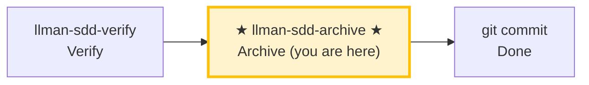

# LLMAN SDD Archive

Use this skill to archive completed changes. **BDD-off**: merge delta specs into main specs. **BDD-on**: move change docs only (specs already live on the feature branch), then promote via a local merge into the default branch (`git push` / hosting PR are optional).

## Pipeline Position



> 📍 You are in the archive phase: the last stop in the pipeline.
> 📎 If specs get too large, run `llman-sdd-specs-compact` to compress.

## Hard Constraints

- **Must pass verify phase all-green first**: don't archive changes that haven't passed verification.
- **SSOT validation**: every change must pass `llman sdd validate <id> --strict --no-interactive` before archiving.
- **Don't ask "should I continue?"**: execute the full batch to completion unless you hit an unresolvable error.
- **BDD-on close-out MUST NOT default to PR/push**: after docs archive, default to merging the feature branch into the default branch **locally** (e.g. `git switch <default> && git merge --ff-only <feature>`). `git push` / hosting PR (`gh pr create`/`gh pr merge`) are optional — only when the user or project explicitly requires remote review. **Agent MUST NOT** push or open a PR by default on this skill's account.

## Steps

### 0) Preflight
- `git status --porcelain`: confirm working tree changes belong to completed changes.
- If unexpected changes exist, handle them (stash or report).

### 1) Confirm target changes
- Determine target IDs: single or batch (from user input or `llman sdd list --json`).
- Always announce: "Archiving IDs: <id1>, <id2>, ...".
- Confirm each change has passed verify phase all-green.

### 2) Archive one by one
- Validate each first: `llman sdd validate <id> --strict --no-interactive`.
- Validation failure → STOP and report; don't skip validation and force archive.
- Optional preview: `llman sdd change archive <id> --dry-run`.
- Execute archive:
  - default: `llman sdd change archive <id>`
  - tooling-only: `llman sdd change archive <id> --skip-specs`
  - **stop immediately on first failure**, report remaining unprocessed IDs.
- **BDD-on (Git-native Partitioned SSOT)**:
  - Prerequisites: `llman sdd change attach <id>` done, still on the feature branch.
  - `change archive` / `change finalize` move **change documentation only** into `changes/archive/` — they do **not** merge TOON deltas as SSOT and never apply `feature_delta`.
  - Legacy active `*.feature.delta.toon` under the change is a migration blocker — remove/migrate before archive.
  - After archive, promote live `llmanspec/specs/**` via a local merge of the feature branch into the default branch (`git switch <default> && git merge --ff-only <feature>`; push / hosting PR optional).
  - **Recommended: single-commit close (`change finalize`)** — same process runs gates → writes frontmatter (`checkpointed` / `checkpoint_sha = base_sha`) → docs-only archive; leaves the tree dirty once for **one `git commit`**:
    ```text
    1. Implement live specs + code (working tree may stay dirty)
    2. llman sdd change finalize <id>   # gates + frontmatter + move change docs
    3. git commit                       # one commit: impl + frontmatter + archive rename
    ```
    **`checkpoint_sha` semantics**: finalize writes attach-time `base_sha`, not the implementation HEAD (under single-commit mode that commit has not happened yet). For a strict implementation SHA, use the fallback below.
  - **Fallback: multi-commit sequence (`checkpoint` + `archive`)** — when you need a strict `checkpoint_sha`, or want a mid-flight review snapshot:
    ```text
    1. git commit   # commit live specs + code (clean tree required for checkpoint)
    2. llman sdd change checkpoint <id>   # writes checkpointed / checkpoint_sha (implementation HEAD)
    3. git commit   # commit proposal.md checkpoint metadata
    4. llman sdd change archive <id>      # moves change docs only
    5. git commit   # commit archive rename
    ```
- **BDD-off**:
  - `change archive` merges change-scoped TOON deltas into main `spec.toon` as today.
  - No attach / checkpoint / feature-branch / harness requirements.

### 3) Full validation
- After all archives complete: `llman sdd validate --all --strict --no-interactive`.
- Confirm post-archive spec artifacts are consistent.

### 4) Commit / merge guidance
- BDD-off: suggest commit message (format: `feat(sdd): archive <id1>, <id2> - <short summary>`), then `git add -A && git commit -m "..."`.
- BDD-on: after docs archive, merge the feature branch into the default branch locally (`git switch <default> && git merge --ff-only <feature>`; optional `git branch -d <feature>`). push / hosting PR only when the user or project explicitly requires remote review.
- If user requests auto-commit of the archive docs commit, execute and output commit hash.
- **Archived `depends_on`**: archive renames the change dir to `archive/YYYY-MM-DD-<id>`, but validate recognizes `depends_on` pointing to archived/frozen ids as INFO (not ERROR), so you do **not** need to manually update other changes' `depends_on` frontmatter after archive.

> 💡 Previous phase `llman-sdd-verify` (passed verification) → this phase completes the loop. If specs grow too large, run `llman-sdd-specs-compact`.

## Archive Cold Backup Guidance
- If archived directories are growing too large, use cold backup maintenance:
  - Preview freeze candidates: `llman sdd archive freeze --dry-run`
  - Freeze old archives: `llman sdd archive freeze --before <YYYY-MM-DD> --keep-recent <N>`
  - Restore when needed: `llman sdd archive thaw --change <YYYY-MM-DD-id>`
- Apply freeze/thaw only to dated archive directories (`YYYY-MM-DD-*`) and keep a small recent window unfrozen when possible.

Before acting, read `llmanspec/config.yaml` and follow its `context` and `rules` if present.

Common commands:
- `llman sdd context --task "<description>" --paths "<files>"` (find relevant specs). Uses the pageindex agentic tree backend (needs `LLMAN_SDD_INDEX_CHAT_MODEL`). Preset via `LLMAN_SDD_INDEX_BACKEND`.
- `llman sdd list` (list changes)
- `llman sdd list --specs` (list specs with purpose/scope metadata)
- `llman sdd show <id>` (show change/spec)
- `llman sdd validate <id>` (validate a change or spec)
- `llman sdd validate --all` (bulk validate)
- `llman sdd index rebuild` (rebuild the pageindex tree index — no model needed)
- `llman sdd index check` (check index freshness)
- `llman sdd change new <id>` (create draft `changes/<id>/proposal.md`)


- `llman sdd change delta …` (BDD-off only: TOON delta authoring; rejected when BDD-on)

- `llman sdd change archive <id>` (seal a change; BDD-on: docs only after checkpoint / finalize fallback; BDD-off: merge TOON deltas)
- `llman sdd archive freeze [--before YYYY-MM-DD] [--keep-recent N] [--dry-run]` (freeze archived dirs)
- `llman sdd archive thaw [--change <id> ...] [--dest <path>]` (restore from cold-backup)
- `llman sdd graph [CHANGE] [--format mermaid] [--scope active|archived|all] [--depth N]` (generate change dependency graph)
- `llman sdd project migrate [--kind format|partitioned|legacy-bdd|auto]` (one-shot migrations)

Validation fixes (TOON standalone specs):

1) Missing validation scope (`Spec valid_scope must not be empty`):
Main specs MUST carry a non-empty `valid_scope` inside the `.toon` document.
`llmanspec/specs/<feature-id>/spec.toon`:
```toon
kind: llman.sdd.spec
name: sample
purpose: "One-line overview."
valid_scope[1]: src
requirements[1]{req_id,title,statement}:
  r1,Title,System MUST do something.
scenarios[1]{req_id,id,given,when,then}:
  r1,happy,"",a trigger happens,the outcome is observed
```

2) No delta ops in a change: add at least one op + scenario in
`llmanspec/changes/<change-id>/specs/<feature-id>/spec.toon`:
```toon
kind: llman.sdd.delta
ops[1]{op,req_id,title,statement,from,to,name}:
  add_requirement,r1,Title,System MUST do something.,null,null,null
op_scenarios[1]{req_id,id,given,when,then}:
  r1,happy,"",a trigger happens,the outcome is observed
```

3) Tabular value quoting error ("Expected N tabular row values, but got M"):
Values containing **spaces**, commas, colons, or brackets MUST be double-quoted in tabular rows.
```toon
# BAD: spaces in an unquoted value split it into multiple values
r1,happy,"",a trigger happens,the outcome is observed

# GOOD: multi-word values quoted
r1,happy,"","a trigger happens","the outcome is observed"
```

4) BDD-on guardrail (Git-native Partitioned SSOT):
When `config.yaml` has `bdd:`: `spec.toon` = constraints / non-executable scenarios; `*.feature` = executable GWT (`@req`). Edit live files on a non-default branch → `change attach` → prefer `change finalize` (single commit) or fallback `checkpoint` → docs-only `change archive` → Git merge. Do not hunt for solidify, and do not create `*.feature.delta.toon` (if one already exists it is a migration blocker — run `project migrate --kind partitioned`). Empty requirements with no `.feature` = ERROR.

Notes:
- Each spec is a single standalone `.toon` file; there is no Markdown shell or ```toon fence.
- `null` represents missing optional fields.
- Migrate legacy `.md`+fence specs with `llman sdd migrate`.

## Context
- Gather the current change/spec state before acting.
- Prefer `llman sdd context --task --paths` to discover relevant specs instead of guessing or full scans.

## Goal
- State the concrete outcome for this command/skill execution.

## Constraints
- Keep changes minimal and scoped.
- Avoid guessing when identifiers or intent are ambiguous.
- Use `llman sdd context --task --paths` before reading full spec files.
- Choose workflow path based on change scale: behavioral contract changes use full SDD, implementation changes use quick path.

## Workflow
- Use `llman sdd` commands as the source of truth.
- Validate outcomes when files or specs are updated.
- Prefer `llman sdd context` over full reads or guessing.
- When context is unavailable follow error guidance (rebuild index or fall back to `list --specs --json`).

## Decision Policy
- Ask for clarification when a high-impact ambiguity remains.
- Stop instead of forcing through known validation errors.

## Output Contract
- Summarize actions taken.
- Provide resulting paths and validation status.

## Ethics Governance
- `ethics.risk_level`: classify risk as `low|medium|high|critical`.
- `ethics.prohibited_actions`: list actions that MUST NOT be performed.
- `ethics.required_evidence`: list required evidence before high-impact output.
- `ethics.refusal_contract`: define when to refuse and safe alternative response.
- `ethics.escalation_policy`: define when to escalate to user confirmation/review.
