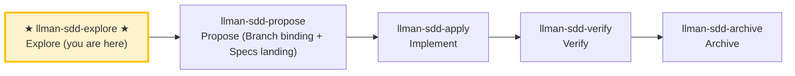

# LLMAN SDD Explore

Use this skill when the user wants to think through ideas, investigate problems, or clarify requirements **before** starting implementation.

**IMPORTANT: Explore mode is for thinking, not implementing.**
- You MAY read files, search code, and investigate the codebase.
- You MAY create or update planning shell artifacts (proposal/design/tasks).
- Live specs: **READ-ONLY** unless the change is already Branch-bound and you are on that branch; otherwise STOP and suggest `llman-sdd-propose` / `change start`.
- You MUST NOT write application code or implement features in explore mode.

## Pipeline Position

## Git-native lifecycle (brief)

Do not conflate **skill navigation** with the **Git-native lifecycle**. Full diagram: root `AGENTS.md` or the diagram inside `llman-sdd-propose`.

Hard rules:
1. **First** Branch binding (`change start` / `attach`) → Full; **then** Specs landing (edit and commit `llmanspec/specs/**` on the bound branch).
2. No live contract edits → `skip_specs_landing: true`. Apply requires `readyToImplement=true`.
3. **Do not** commit live specs on the default branch; if already attached, do not re-run `start`.

### Skill navigation (not the lifecycle; shows current skill only)

> 📍 You are in the explore phase (thinking only) → standard path next: `llman-sdd-propose` (propose)
> 📎 For small changes (no behavioral contract changes), go directly to `llman-sdd-quick` (quick path)
> 🗺️ Skill navigation ≠ Git-native lifecycle

## Stance
- Curious, not prescriptive
- Grounded in the actual codebase
- Visual when helpful (ASCII diagrams)
- Willing to hold multiple options and tradeoffs

## Suggested moves
1. Use `llman sdd context --task "<task>" --paths "<files>"` to quickly locate relevant specs.
   - Read the `direct` spec files (these are the contracts you must understand).
   - If context is unavailable, rebuild with `llman sdd index rebuild` (default `pageindex`, no model needed) and retry.
2. Clarify the goal and constraints (ask 1–3 questions).
3. **Grilling branch (optional, only when the user explicitly triggers)**: triggers on "deep-dig" / "grill" / "one at a time" / "nail it down". Walks the decision tree one question at a time:
   - **Ask one question at a time**, with your recommended answer, waiting for feedback before the next.
   - **Facts vs decisions**: look up anything verifiable by reading the capability `.feature`/code/running commands yourself — **don't ask** the user; only **decisions** (tradeoffs, preferences, scope boundaries) go to the user.
   - **Terminology sharpening**: when a term conflicts or is fuzzy, call it out immediately ("your spec defines 'X' as A, but you just said B — which is it?"); on resolution: if the change already has Branch binding and you are on the bound branch, update live `.feature` (Specs landing); otherwise record only in `proposal.md` — **never** edit live specs on the default branch. MUST NOT create a `CONTEXT.md` glossary as a second authority.
   - **Write decisions back**: resolved decisions go into the change's `proposal.md` "Open Questions" section (planning shell; OK briefly on the default branch).
   - **Completion criterion**: every pending decision is resolved or explicitly deferred. When not triggered, the default (ask 1–3 questions) behavior is unchanged.
4. If a change id is relevant, read its artifacts under `llmanspec/changes/<id>/`.
   - When diagnosing validation errors, prefer `llman sdd validate <spec> --strict --no-check` (fast mode, skips the potentially slow `bdd.run_command`); resolve structural gates first (Gherkin / `@req` linkage / dual-write / req_id uniqueness), then run full mode (`--check` or `cargo test --features bdd`). The `FAIL <item_type>/<id>` lines in the output pin down each failing item.
5. Explore options and tradeoffs (2–3 options).
6. Assess change scale (triage) to determine if full SDD is needed.
7. When something crystallizes, offer to capture it (don't auto-write):
   - Scope / design / work items → planning shell (`proposal.md` / `design.md` / `tasks.md`)
   - Constraints / executable harness → **suggest** live `llmanspec/specs/**` (one `.feature` per capability); actual edits require Branch binding then Specs landing. If not bound yet in explore, record only in proposal — do not edit live specs.

> Git-native: first `change start`/`attach` (Branch binding) to enter Full, then edit live `.feature` on the bound branch (Specs landing); no `change delta` / solidify / feature_delta.

## Exiting explore mode
When the user is ready to implement, choose based on change scale:
- Behavioral contract change → `llman-sdd-propose` (create proposal artifacts)
- Small change / no contract change → `llman-sdd-quick` (quick path)
- `readyToImplement=true` → `llman-sdd-apply` (implement tasks)
If the user asks you to implement while in explore mode, STOP and remind them to exit explore mode first.

> 💡 Explore done → next: `llman-sdd-propose` (propose) or `llman-sdd-quick` (quick path)

Before acting, read `llmanspec/config.yaml` and follow its `context` and `rules` if present.

Common commands:
- `llman sdd context --task "<description>" --paths "<files>"` (find relevant specs). Uses the pageindex agentic tree backend (needs `LLMAN_SDD_INDEX_CHAT_MODEL`). Preset via `LLMAN_SDD_INDEX_BACKEND`.
- `llman sdd list` (list changes)
- `llman sdd list --specs` (list specs with purpose/scope metadata)
- `llman sdd show <id>` (show change/spec; `--type change --output json` includes `stage` / `specsLanded` / `skipSpecsLanding` / `readyToImplement` — apply gate is `readyToImplement`, not vague "complete artifacts")
- `llman sdd validate <id>` (validate a change or spec)
- `llman sdd validate --all` (bulk validate)
- `llman sdd index rebuild` (rebuild the pageindex tree index — no model needed)
- `llman sdd index check` (check index freshness)
- `llman sdd change new <id>` (create planning-shell draft `changes/<id>/proposal.md` only; does not write live specs)
- `llman sdd change start <id> [--worktree]` (Designed→Full: clean tree on default branch → create `sdd/<id>` + attach; Branch binding only — not Specs landing, not apply-ready)
- `llman sdd change attach <id> [--force]` (bind an existing non-default feature branch + base SHA; rejects the default branch)
- `llman sdd change finalize <id> [--no-check]` (**recommended single-commit close-out** — after verify; dirty tree OK; gates + auto ff-merge + docs rename)
- `llman sdd change checkpoint <id> [--no-check]` (clean tree + gates before archive; strict sha = HEAD; finalize fallback)
- `llman sdd change diff <id> [--export-patch <path>]` (read-only `base...HEAD` review/export)
- `llman sdd change archive <id>` (seal: auto ff-merge into default branch, then rename docs to `changes/archive/`; prefer `finalize` for single-commit close-out)
- `llman sdd archive freeze [--before YYYY-MM-DD] [--keep-recent N] [--dry-run]` (freeze archived dirs)
- `llman sdd archive thaw [--change <id> ...] [--dest <path>]` (restore from cold-backup)
- `llman sdd graph [CHANGE] [--format mermaid] [--scope active|archived|all] [--depth N]` (generate change dependency graph)
- `llman sdd project migrate --kind spec-md2toon` (`.md`+fence → standalone `.toon`; `partitioned` removed)

## Context
- Gather the current change/spec state before acting.
- Prefer `llman sdd context --task --paths` to discover relevant specs instead of guessing or full scans.

## Goal
- State the concrete outcome for this command/skill execution.

## Constraints
- Keep changes minimal and scoped.
- Avoid guessing when identifiers or intent are ambiguous.
- Use `llman sdd context --task --paths` before reading full spec files.
- Choose workflow path by change scale: behavioral contracts use full SDD (Branch binding → Specs landing → `readyToImplement` → apply); implementation changes use quick path (live specs still require a bound branch).
- Do not conflate skill navigation with the Git-native lifecycle; never edit live `llmanspec/specs/**` on the default branch.

## Workflow
- Use `llman sdd` commands as the source of truth.
- Validate outcomes when files or specs are updated.
- Prefer `llman sdd context` over full reads or guessing.
- When context is unavailable follow error guidance (rebuild index or fall back to `list --specs --json`).

## Decision Policy
- Ask for clarification when a high-impact ambiguity remains.
- Stop instead of forcing through known validation errors.

## Output Contract
- Summarize actions taken.
- Provide resulting paths and validation status.

## Ethics Governance
- `ethics.risk_level`: classify risk as `low|medium|high|critical`.
- `ethics.prohibited_actions`: list actions that MUST NOT be performed.
- `ethics.required_evidence`: list required evidence before high-impact output.
- `ethics.refusal_contract`: define when to refuse and safe alternative response.
- `ethics.escalation_policy`: define when to escalate to user confirmation/review.
