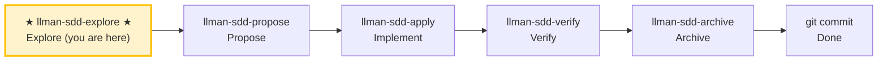

# LLMAN SDD Explore

Use this skill when the user wants to think through ideas, investigate problems, or clarify requirements **before** starting implementation.

**IMPORTANT: Explore mode is for thinking, not implementing.**
- You MAY read files, search code, and investigate the codebase.
- You MAY create or update llman SDD artifacts (proposal/specs/design/tasks) if the user asks.
- You MUST NOT write application code or implement features in explore mode.

## Pipeline Position

> 📍 You are in the explore phase (thinking only) → standard path next: `llman-sdd-propose` (propose)
> 📎 For small changes (no behavioral contract changes), go directly to `llman-sdd-quick` (quick path)

## Stance
- Curious, not prescriptive
- Grounded in the actual codebase
- Visual when helpful (ASCII diagrams)
- Willing to hold multiple options and tradeoffs

## Suggested moves
1. Use `llman sdd context --task "<task>" --paths "<files>"` to quickly locate relevant specs.
   - Read the `direct` spec files (these are the contracts you must understand).
   - If context is unavailable, rebuild with `llman sdd index rebuild` (default `pageindex`, no model needed) and retry.
2. Clarify the goal and constraints (ask 1–3 questions).
3. If a change id is relevant, read its artifacts under `llmanspec/changes/<id>/`.
   - When diagnosing validation errors, prefer `llman sdd validate <spec> --strict --no-check` (fast mode, skips the potentially slow `bdd.run_command`); resolve structural gates first (Gherkin / `@req` linkage / dual-write / req_id uniqueness), then run full mode (`--check` or `cargo test --features bdd`). The `FAIL <item_type>/<id>` lines in the output pin down each failing item.
4. Explore options and tradeoffs (2–3 options).
5. Assess change scale (triage) to determine if full SDD is needed.
6. When something crystallizes, offer to capture it (don't auto-write):
   - Scope changes → `proposal.md`
   - BDD-off constraints/scenarios → `llmanspec/changes/<id>/specs/<capability>/spec.toon` (TOON deltas)
   - BDD-on constraints → live `llmanspec/specs/<capability>/spec.toon` on a feature branch
   - BDD-on executable harness → live `llmanspec/specs/<capability>/*.feature` (`@req`); never `*.feature.delta.toon`
   - Design decisions → `design.md`
   - Work items → `tasks.md`

> BDD-on (Git-native Partitioned): feature branch + live `.feature`/`spec.toon` are SSOT; bind with `change attach`; no solidify / feature_delta.

## Exiting explore mode
When the user is ready to implement, choose based on change scale:
- Behavioral contract change → `llman-sdd-propose` (create proposal artifacts)
- Small change / no contract change → `llman-sdd-quick` (quick path)
- Already have complete change artifacts → `llman-sdd-apply` (implement tasks)
If the user asks you to implement while in explore mode, STOP and remind them to exit explore mode first.

> 💡 Explore done → next: `llman-sdd-propose` (propose) or `llman-sdd-quick` (quick path)

Before acting, read `llmanspec/config.yaml` and follow its `context` and `rules` if present.

Common commands:
- `llman sdd context --task "<description>" --paths "<files>"` (find relevant specs). Uses the pageindex agentic tree backend (needs `LLMAN_SDD_INDEX_CHAT_MODEL`). Preset via `LLMAN_SDD_INDEX_BACKEND`.
- `llman sdd list` (list changes)
- `llman sdd list --specs` (list specs with purpose/scope metadata)
- `llman sdd show <id>` (show change/spec)
- `llman sdd validate <id>` (validate a change or spec)
- `llman sdd validate --all` (bulk validate)
- `llman sdd index rebuild` (rebuild the pageindex tree index — no model needed)
- `llman sdd index check` (check index freshness)
- `llman sdd change new <id>` (create draft `changes/<id>/proposal.md`)

- `llman sdd change delta …` (BDD-off only: TOON delta authoring; rejected when BDD-on)

- `llman sdd change archive <id>` (seal a change; BDD-on: docs only after checkpoint / finalize fallback; BDD-off: merge TOON deltas)
- `llman sdd archive freeze [--before YYYY-MM-DD] [--keep-recent N] [--dry-run]` (freeze archived dirs)
- `llman sdd archive thaw [--change <id> ...] [--dest <path>]` (restore from cold-backup)
- `llman sdd graph [CHANGE] [--format mermaid] [--scope active|archived|all] [--depth N]` (generate change dependency graph)
- `llman sdd project migrate [--kind format|partitioned|legacy-bdd|auto]` (one-shot migrations)

## Context
- Gather the current change/spec state before acting.
- Prefer `llman sdd context --task --paths` to discover relevant specs instead of guessing or full scans.

## Goal
- State the concrete outcome for this command/skill execution.

## Constraints
- Keep changes minimal and scoped.
- Avoid guessing when identifiers or intent are ambiguous.
- Use `llman sdd context --task --paths` before reading full spec files.
- Choose workflow path based on change scale: behavioral contract changes use full SDD, implementation changes use quick path.

## Workflow
- Use `llman sdd` commands as the source of truth.
- Validate outcomes when files or specs are updated.
- Prefer `llman sdd context` over full reads or guessing.
- When context is unavailable follow error guidance (rebuild index or fall back to `list --specs --json`).

## Decision Policy
- Ask for clarification when a high-impact ambiguity remains.
- Stop instead of forcing through known validation errors.

## Output Contract
- Summarize actions taken.
- Provide resulting paths and validation status.

## Ethics Governance
- `ethics.risk_level`: classify risk as `low|medium|high|critical`.
- `ethics.prohibited_actions`: list actions that MUST NOT be performed.
- `ethics.required_evidence`: list required evidence before high-impact output.
- `ethics.refusal_contract`: define when to refuse and safe alternative response.
- `ethics.escalation_policy`: define when to escalate to user confirmation/review.
