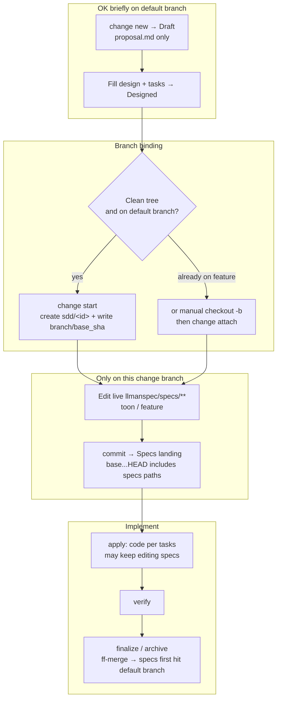
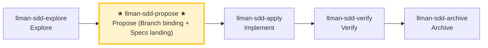

# LLMAN SDD Propose

Create a new change with planning artifacts (proposal + tasks; design optional), **first** `change start` (or `attach`) for Branch binding, **then** edit live `llmanspec/specs/<capability>/*.feature` on the bound branch (Specs landing), validate, and suggest next actions.

## Pipeline Position

## Git-native lifecycle (full diagram)

Do not conflate two layers: the **Git-native lifecycle** (Branch binding → Specs landing → `readyToImplement`) vs **skill navigation** (explore→propose→apply→verify→archive). Specs landing is **not** a separate skill.



Hard rules:
1. **First** `change start` / `attach` (Branch binding) to enter Full; **then** edit `llmanspec/specs/**` on the bound non-default branch and commit (Specs landing).
2. For changes with no live contract edits, set frontmatter `skip_specs_landing: true`. Enter apply only when `llman sdd show <id> --json` has `readyToImplement=true` (`Full ∧ (specsLanded ∨ skip)`).
3. **Do not** commit live specs to the default branch just to satisfy the clean-tree gate; if already attached, do not re-run `start`.

### Skill navigation (not the lifecycle; shows current skill only)



> 📍 You are in propose: Git-native path above is **Designed → Branch binding → Specs landing** (until `readyToImplement=true`) → next: `llman-sdd-apply`
> 📎 For small changes (no behavioral contract changes), use `llman-sdd-quick` (quick path)

## Hard Constraints

- **Must confirm change id with user before writing files**: change boundaries must stay clear. **Exception**: when the user wants to quickly capture an idea (draft only, no id needed), route them to `llman-sdd-draft` instead of running full propose.
- **Live specs are SSOT**: edit `llmanspec/specs/**` only **after** Branch binding, on the **bound non-default branch** (Specs landing). **Do not** edit live specs on the default branch; **do not** author under `changes/<id>/specs/` or use `change delta` (removed). The planning shell may briefly live on the default branch.
- **Don't ask "should I continue?"**: execute the full propose phase in one pass, generate artifacts and validate.

- **If change already exists**: STOP. If `readyToImplement=true`, suggest `llman-sdd-apply`; otherwise finish the planning shell / Branch binding / Specs landing (edit `llmanspec/changes/<id>/`, or enable `extra_skills: [llman-sdd-continue]`).

- **Frontmatter has a fixed schema**: when fleshing out `proposal.md`, only the allowed fields in `llmanspec/AGENTS.md` "Change Proposal Frontmatter SSOT" are accepted (including `depends_on`, `blocks`, `branch`, `base_sha`/`baseSha`, `checkpointed`, `checkpoint_sha`/`checkpointSha`, `skip_specs_landing`). `status`/`title`/`priority`/`author` etc. are rejected by `llman sdd validate` as ERROR; lifecycle stage is inferred (query via `llman sdd status`/`show`), never stored in frontmatter. Do not re-declare frontmatter fields in the prose body; the body H1 is a human-readable title, not a repeat of the change id.

## Quick-capture routing

If the user just wants to **capture an idea** (e.g. "draft a proposal", "note down X", "remember to do Y later") without full planning, route them to the `llman-sdd-draft` skill — it creates a `proposal.md`-only draft shell via `change new --from` (no id asked, no tasks/specs/attach). Full propose (triage + tasks → `change start`/`attach` → Specs landing) starts here.

## Steps

### 0) Preflight
- Read `llmanspec/config.yaml` for project context, rules, locale.
- `llman sdd validate --all --strict --no-interactive`: ensure current artifacts are clean.
  - If pre-existing errors, stop and report (stacking new changes on dirty artifacts causes cascading errors).
- **Check spec valid_scope integrity**: use `llman sdd list --specs --json` to list all specs, then for each spec verify every path in its `valid_scope` exists on disk. If any scope file/directory is missing, stop and suggest updating the spec (remove the deleted path from `valid_scope`).

### 1) Assess change scale (triage)
   - **Behavioral contract change** (modify MUST/SHALL, change external behavior) → full SDD workflow
   - **Implementation change** (refactor, typo, perf) → quick path via `llman-sdd-quick`
   - **Meta-spec change** (SDD templates/process) → full SDD workflow
   - When uncertain, choose full SDD (conservative).
2. Use `llman sdd context --task "<goal>" --paths "<scope>"` to find relevant specs.
   - If context unavailable, rebuild with `llman sdd index rebuild` (default `pageindex`, no model needed) and continue.
3. Gather input:
   - A short description of the change
   - A change id (or derive one; kebab-case, verb prefix: `add-`, `update-`, `remove-`, `refactor-`)
   - The impacted capability/capabilities (to name `specs/<capability>/`)
   - Confirm the final id before writing files

### 2) Ensure project is initialized:
   - `llmanspec/` must exist; if missing, tell the user to run `llman sdd init`, then STOP.

### 3) Create change directory and artifacts
   - Prefer `llman sdd change new <change-id>` for the draft `proposal.md` shell (or create `llmanspec/changes/<change-id>/` manually).

   - If the change already exists, STOP and suggest filling missing artifacts or `llman-sdd-apply` (optionally enable continue via `extra_skills`).

   - Flesh out `proposal.md` (Why / What Changes / Capabilities / Impact)
   - `design.md` only when tradeoffs/migrations matter
   - **Confirm seams before writing tasks.md**: list the seams to be tested and confirm with the user. A seam = the public boundary driven by `*.feature` GWT steps (CLI subprocess or public interface) — MUST reuse existing harness seams, MUST NOT invent seams detached from `.feature`. Without `.feature`, seam = the CLI subcommand or public function boundary under test.
   - `tasks.md`: split into **vertical slices** (each task cuts a narrow but complete path through schema→API→UI→tests, independently verifiable), with `[blocked-by: <task-id>]` dependency markers. **Wide-refactor exception** (one mechanical change sweeping the codebase, single edit breaks many call sites): sequence as expand-contract (add new beside old → migrate call sites in batches → delete old), don't force into a vertical slice.
   - **First** `llman sdd change start <change-id>` (recommended; clean tree on the default branch) or manually create a branch then `change attach <change-id>` to reach Full (bound).
   - **Then** edit live `llmanspec/specs/<capability>/<capability>.feature` on the bound non-default branch and commit (Specs landing). **Do not** edit live specs before start; **do not** commit live specs to the default branch just to satisfy the clean-tree gate. If already attached, do not re-run `start` (recover lost specs by checkout/recreate + `attach --force` if needed).
   - For changes with no live contract edits, set frontmatter `skip_specs_landing: true`. Enter apply only when `llman sdd show <id> --json` has `readyToImplement=true`.

### 4) Validate:
   ```bash
   llman sdd validate <change-id> --strict --no-interactive
   ```
   This MUST pass before proceeding. If TOON parse errors appear, fix quoting:
   values containing commas/colons/brackets must be double-quoted in tabular rows.

### 4a) Optional BDD runner (`bdd:` block)
- Read `llmanspec/config.yaml`. Is there a `bdd:` block?
  - **Yes**: `validate --check` runs the harness; authoring follows 4b regardless.
  - **No**: if this change involves executable behavior scenarios (Given/When/Then the user will want to run), ask **once, up front**: "This change looks like it has executable behavior. Enable a `bdd:` runner block so scenarios can be validated as `.feature` files? (adds a `bdd:` block to `config.yaml` — runner only, does not change the lifecycle.)"
    - If **yes**: show the exact `bdd:` block to add (pick a `run_command` matching the project's test framework — `cargo test --features bdd` for rstest-bdd, `pytest {feature_dir} -k {feature_name} -v` for pytest-bdd). Let the user confirm or edit it, write it to `config.yaml`, then proceed with 4b rules.
    - If **no**: features still validate structurally; only runner execution is skipped.
- **Do NOT silently add the `bdd:` block** — always ask first. Adding it changes how `validate --check` behaves project-wide.

### 4b) Single-track feature authoring
- Planning shell (proposal/design/tasks) may briefly live on the default branch; **do not** edit live `llmanspec/specs/**` on the default branch. After Branch binding, Specs landing and implementation happen on the bound branch.
- **Single-track**: each capability is ONE `<capability>.feature`. Constraint rules are `@req:<id> @human` scenarios (statement verbatim in the description); executable acceptance scenarios carry `@executable` and link back via `@req:<req_id>`. Never nest scenarios in `Rule:` blocks (the runner skips them).
- Change shell: `llman sdd change new <change-id>` → fill proposal/design/tasks → `llman sdd change start <change-id>` (or `change attach`) → **then** edit live specs on the bound branch and commit (Specs landing).
- Do **not** use `change delta` / solidify / `*.feature.delta.toon`; if an active `*.feature.delta.toon` or a legacy `spec.toon` exists, run `llman sdd project migrate --kind toon2features` first.

### 5) Summarize and suggest next step:
   - Enter implementation phase: `llman-sdd-apply`.
   - If you need to think more: `llman-sdd-explore`.

> 💡 Proposal done → next: `llman-sdd-apply` (implement)

Before acting, read `llmanspec/config.yaml` and follow its `context` and `rules` if present.

Common commands:
- `llman sdd context --task "<description>" --paths "<files>"` (find relevant specs). Uses the pageindex agentic tree backend (needs `LLMAN_SDD_INDEX_CHAT_MODEL`). Preset via `LLMAN_SDD_INDEX_BACKEND`.
- `llman sdd list` (list changes)
- `llman sdd list --specs` (list specs with purpose/scope metadata)
- `llman sdd show <id>` (show change/spec; `--type change --output json` includes `stage` / `specsLanded` / `skipSpecsLanding` / `readyToImplement` — apply gate is `readyToImplement`, not vague "complete artifacts")
- `llman sdd validate <id>` (validate a change or spec)
- `llman sdd validate --all` (bulk validate)
- `llman sdd index rebuild` (rebuild the pageindex tree index — no model needed)
- `llman sdd index check` (check index freshness)
- `llman sdd change new <id>` (create planning-shell draft `changes/<id>/proposal.md` only; does not write live specs)
- `llman sdd change start <id> [--worktree]` (Designed→Full: clean tree on default branch → create `sdd/<id>` + attach; Branch binding only — not Specs landing, not apply-ready)
- `llman sdd change attach <id> [--force]` (bind an existing non-default feature branch + base SHA; rejects the default branch)
- `llman sdd change finalize <id> [--no-check]` (**recommended single-commit close-out** — after verify; dirty tree OK; gates + auto ff-merge + docs rename)
- `llman sdd change checkpoint <id> [--no-check]` (clean tree + gates before archive; strict sha = HEAD; finalize fallback)
- `llman sdd change diff <id> [--export-patch <path>]` (read-only `base...HEAD` review/export)
- `llman sdd change archive <id>` (seal: auto ff-merge into default branch, then rename docs to `changes/archive/`; prefer `finalize` for single-commit close-out)
- `llman sdd archive freeze [--before YYYY-MM-DD] [--keep-recent N] [--dry-run]` (freeze archived dirs)
- `llman sdd archive thaw [--change <id> ...] [--dest <path>]` (restore from cold-backup)
- `llman sdd graph [CHANGE] [--format mermaid] [--scope active|archived|all] [--depth N]` (generate change dependency graph)
- `llman sdd project migrate --kind spec-md2toon` (`.md`+fence → standalone `.toon`; `partitioned` removed)
Validation fixes (single-track feature-as-spec):

1) Missing header comments (`missing `# capability:`` header comment`):
Every `llmanspec/specs/<capability>/<capability>.feature` MUST start with:
```
# language: zh-CN
# capability: <capability>
# purpose: One-line overview.
# scope: src/
```

2) Tag grammar (`@human constraint scenario must carry an @req:<req_id> tag` / `orphan acceptance scenario`):
- Rules: `@req:<id> @human` — statement in the scenario description (MUST/SHALL required).
- Acceptance: `@executable` + at least one `@req:<id>` linking a rule.
- `@manual` requires `@human`. Never combine `@human` with `@executable`.

3) Legacy `spec.toon` present (`legacy spec.toon found ... run ... toon2features`):
Run `llman sdd project migrate --kind toon2features --yes`, review the diff, commit.

Git-native guardrail:
- **Branch binding** → **Specs landing**: first `change start` / `attach`, then edit live `.feature` files on the bound non-default branch and commit.
- Locked rules: modifying/removing existing `@human` scenarios fails the gate unless the proposal frontmatter has `rules_edit_acked: true`.
- Apply requires `readyToImplement=true` (or `skip_specs_landing`). Close-out prefers `change finalize`.
- Do not use `change delta` / solidify / `*.feature.delta.toon`.

## Context
- Gather the current change/spec state before acting.
- Prefer `llman sdd context --task --paths` to discover relevant specs instead of guessing or full scans.

## Goal
- State the concrete outcome for this command/skill execution.

## Constraints
- Keep changes minimal and scoped.
- Avoid guessing when identifiers or intent are ambiguous.
- Use `llman sdd context --task --paths` before reading full spec files.
- Choose workflow path by change scale: behavioral contracts use full SDD (Branch binding → Specs landing → `readyToImplement` → apply); implementation changes use quick path (live specs still require a bound branch).
- Do not conflate skill navigation with the Git-native lifecycle; never edit live `llmanspec/specs/**` on the default branch.

## Workflow
- Use `llman sdd` commands as the source of truth.
- Validate outcomes when files or specs are updated.
- Prefer `llman sdd context` over full reads or guessing.
- When context is unavailable follow error guidance (rebuild index or fall back to `list --specs --json`).

## Decision Policy
- Ask for clarification when a high-impact ambiguity remains.
- Stop instead of forcing through known validation errors.

## Output Contract
- Summarize actions taken.
- Provide resulting paths and validation status.

## Ethics Governance
- `ethics.risk_level`: classify risk as `low|medium|high|critical`.
- `ethics.prohibited_actions`: list actions that MUST NOT be performed.
- `ethics.required_evidence`: list required evidence before high-impact output.
- `ethics.refusal_contract`: define when to refuse and safe alternative response.
- `ethics.escalation_policy`: define when to escalate to user confirmation/review.
