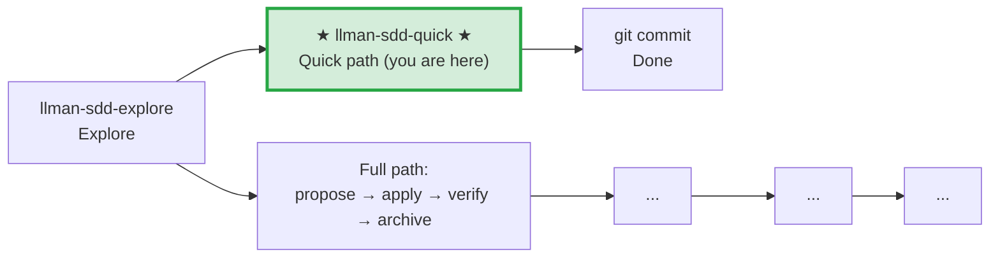

# LLMAN SDD Quick Path

Use this path for small changes that don't modify behavioral contracts.

## Pipeline Position

> 📍 Quick path: no behavioral contract changes, modify code and commit directly. If you find you need to change a contract → STOP, switch to full path `llman-sdd-propose`

## Conditions (all must hold)
- Does not change any MUST/SHALL-defined externally observable behavior
- Does not cross capability boundaries
- Does not involve migration or compatibility concerns
- Is not a meta-spec change (SDD templates/process)

## Steps
1. Use `llman sdd context --task "..." --paths "..."` to confirm no spec changes needed.
   - If context returns `quality: "unavailable"`, rebuild with `llman sdd index rebuild` (default `pageindex`, no model needed).
   - Use `llman sdd list --specs --json` for keyword-level spec metadata.
2. Modify the code directly.
3. If spec maintenance is needed (typo fix, scope tightening), edit the spec file directly and run `llman sdd validate --specs`.
4. git commit (message must explain why).
5. No change directory, no archive needed.

## Boundary handling
- If during modification you find a behavioral contract change → STOP, switch to `llman-sdd-propose` (full path).
- If multiple files are involved and scope is unclear → verify with `llman sdd context` first.

> 💡 Quick path done → git commit. If you need the full path → `llman-sdd-propose` → `llman-sdd-apply` → `llman-sdd-verify` → `llman-sdd-archive`

Before acting, read `llmanspec/config.yaml` and follow its `context` and `rules` if present.

Common commands:
- `llman sdd context --task "<description>" --paths "<files>"` (find relevant specs). Uses the pageindex agentic tree backend (needs `LLMAN_SDD_INDEX_CHAT_MODEL`). Preset via `LLMAN_SDD_INDEX_BACKEND`.
- `llman sdd list` (list changes)
- `llman sdd list --specs` (list specs with purpose/scope metadata)
- `llman sdd show <id>` (show change/spec)
- `llman sdd validate <id>` (validate a change or spec)
- `llman sdd validate --all` (bulk validate)
- `llman sdd index rebuild` (rebuild the pageindex tree index — no model needed)
- `llman sdd index check` (check index freshness)
- `llman sdd change new <id>` (create draft `changes/<id>/proposal.md`)

- `llman sdd change delta …` (BDD-off only: TOON delta authoring; rejected when BDD-on)

- `llman sdd change archive <id>` (seal a change; BDD-on: docs only after checkpoint / finalize fallback; BDD-off: merge TOON deltas)
- `llman sdd archive freeze [--before YYYY-MM-DD] [--keep-recent N] [--dry-run]` (freeze archived dirs)
- `llman sdd archive thaw [--change <id> ...] [--dest <path>]` (restore from cold-backup)
- `llman sdd graph [CHANGE] [--format mermaid] [--scope active|archived|all] [--depth N]` (generate change dependency graph)
- `llman sdd project migrate [--kind format|partitioned|legacy-bdd|auto]` (one-shot migrations)

## Context
- Gather the current change/spec state before acting.
- Prefer `llman sdd context --task --paths` to discover relevant specs instead of guessing or full scans.

## Goal
- State the concrete outcome for this command/skill execution.

## Constraints
- Keep changes minimal and scoped.
- Avoid guessing when identifiers or intent are ambiguous.
- Use `llman sdd context --task --paths` before reading full spec files.
- Choose workflow path based on change scale: behavioral contract changes use full SDD, implementation changes use quick path.

## Workflow
- Use `llman sdd` commands as the source of truth.
- Validate outcomes when files or specs are updated.
- Prefer `llman sdd context` over full reads or guessing.
- When context is unavailable follow error guidance (rebuild index or fall back to `list --specs --json`).

## Decision Policy
- Ask for clarification when a high-impact ambiguity remains.
- Stop instead of forcing through known validation errors.

## Output Contract
- Summarize actions taken.
- Provide resulting paths and validation status.

## Ethics Governance
- `ethics.risk_level`: classify risk as `low|medium|high|critical`.
- `ethics.prohibited_actions`: list actions that MUST NOT be performed.
- `ethics.required_evidence`: list required evidence before high-impact output.
- `ethics.refusal_contract`: define when to refuse and safe alternative response.
- `ethics.escalation_policy`: define when to escalate to user confirmation/review.
