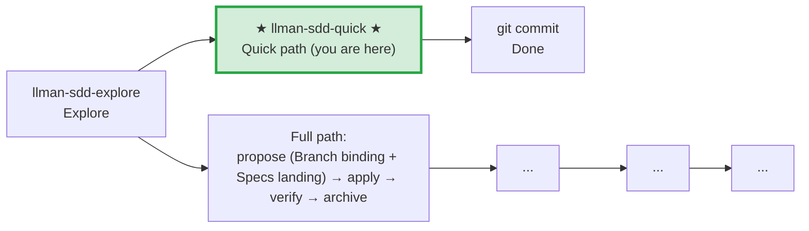

# LLMAN SDD Quick Path

Use this path for small changes that don't modify behavioral contracts.

## Pipeline Position

> 📍 Quick path: no behavioral contract changes, modify code and commit directly. If you find you need to change a contract → STOP, switch to full path `llman-sdd-propose`
> 🗺️ Full path includes Git-native Branch binding + Specs landing (Specs landing is not a separate skill)

## Conditions (all must hold)
- Does not change any MUST/SHALL-defined externally observable behavior
- Does not cross capability boundaries
- Does not involve migration or compatibility concerns
- Is not a meta-spec change (SDD templates/process)

## Steps
1. Use `llman sdd context --task "..." --paths "..."` to confirm no spec changes needed.
   - If context returns `quality: "unavailable"`, rebuild with `llman sdd index rebuild` (default `pageindex`, no model needed).
   - Use `llman sdd list --specs --json` for keyword-level spec metadata.
2. Modify the code directly.
3. If you need to touch `llmanspec/specs/**`, STOP unless you are on a bound non-default change branch (mini change: `change start`/`attach` → edit → commit). Never commit live specs on the default branch — not even for typo or scope-only fixes. Prefer routing live-spec maintenance to `llman-sdd-propose`, or require an existing bound branch.
4. git commit (message must explain why).
5. No change directory, no archive needed.

## Boundary handling
- If during modification you find a behavioral contract change → STOP, switch to `llman-sdd-propose` (full path).
- If multiple files are involved and scope is unclear → verify with `llman sdd context` first.

> 💡 Quick path done → git commit. If you need the full path → `llman-sdd-propose` → `llman-sdd-apply` → `llman-sdd-verify` → `llman-sdd-archive`

Before acting, read `llmanspec/config.yaml` and follow its `context` and `rules` if present.

Common commands:
- `llman sdd context --task "<description>" --paths "<files>"` (find relevant specs). Uses the pageindex agentic tree backend (needs `LLMAN_SDD_INDEX_CHAT_MODEL`). Preset via `LLMAN_SDD_INDEX_BACKEND`.
- `llman sdd list` (list changes)
- `llman sdd list --specs` (list specs with purpose/scope metadata)
- `llman sdd show <id>` (show change/spec; `--type change --output json` includes `stage` / `specsLanded` / `skipSpecsLanding` / `readyToImplement` — apply gate is `readyToImplement`, not vague "complete artifacts")
- `llman sdd validate <id>` (validate a change or spec)
- `llman sdd validate --all` (bulk validate)
- `llman sdd index rebuild` (rebuild the pageindex tree index — no model needed)
- `llman sdd index check` (check index freshness)
- `llman sdd change new <id>` (create planning-shell draft `changes/<id>/proposal.md` only; does not write live specs)
- `llman sdd change start <id> [--worktree]` (Designed→Full: clean tree on default branch → create `sdd/<id>` + attach; Branch binding only — not Specs landing, not apply-ready)
- `llman sdd change attach <id> [--force]` (bind an existing non-default feature branch + base SHA; rejects the default branch)
- `llman sdd change finalize <id> [--no-check]` (**recommended single-commit close-out** — after verify; dirty tree OK; gates + auto ff-merge + docs rename)
- `llman sdd change checkpoint <id> [--no-check]` (clean tree + gates before archive; strict sha = HEAD; finalize fallback)
- `llman sdd change diff <id> [--export-patch <path>]` (read-only `base...HEAD` review/export)
- `llman sdd change archive <id>` (seal: auto ff-merge into default branch, then rename docs to `changes/archive/`; prefer `finalize` for single-commit close-out)
- `llman sdd archive freeze [--before YYYY-MM-DD] [--keep-recent N] [--dry-run]` (freeze archived dirs)
- `llman sdd archive thaw [--change <id> ...] [--dest <path>]` (restore from cold-backup)
- `llman sdd graph [CHANGE] [--format mermaid] [--scope active|archived|all] [--depth N]` (generate change dependency graph)
- `llman sdd project migrate --kind spec-md2toon` (`.md`+fence → standalone `.toon`; `partitioned` removed)

## Ethics Governance
- `ethics.risk_level`: label risk as `low|medium|high|critical`.
- `ethics.prohibited_actions`: list actions that must never be performed.
- `ethics.required_evidence`: list evidence required before high-impact outputs.
- `ethics.refusal_contract`: define when to refuse and the safe alternative response.
- `ethics.escalation_policy`: define when to escalate for user confirmation / human review.
