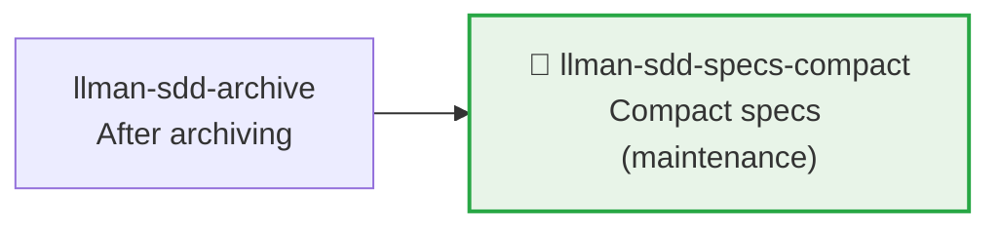

# LLMAN SDD Specs Compact

Use this skill to compact specs without changing normative behavior.

## Pipeline Position



> 📎 Maintenance tool, typically run after accumulating many archives. For daily development → `llman-sdd-propose` (Branch binding + Specs landing) / `llman-sdd-apply` (requires `readyToImplement`).

## Context
- Specs grow bloated with duplicate requirements/scenarios as changes accumulate.
- Compaction must remain verifiable and regressible.
- When archive history is too large, it interferes with compaction review and navigation.

## Goal
- Identify and merge redundant requirements/scenarios.
- Form a more compact and maintainable spec structure.

## Constraints
- Don't delete normative behavior without explicit replacement.
- Try to keep requirement titles stable.
- Each retained requirement must have at least one valid scenario.
- **Editing live `llmanspec/specs/**` requires a change**: Branch binding first (`change start` / `attach`), then commit on the bound branch (Specs landing style); **never** compact-rewrite live specs on the default branch.

## Workflow
1. Inventory current specs (`llman sdd list --specs`).
2. If archived history is large, run archive freeze first:
   - Preview: `llman sdd archive freeze --dry-run`
   - Execute: `llman sdd archive freeze --before <YYYY-MM-DD> --keep-recent <N>`
3. Identify overlapping items across capabilities.
4. Produce a compaction plan (canonical requirements + keep/merge/remove decisions + migration notes).
5. Execute and validate (`llman sdd validate --specs --strict --no-interactive`).

## Decision Policy
- Prefer merging when two requirements are semantically equivalent.
- Only extract shared spec text when reference relationships are clear.
- When archive directory is noisy, suggest freezing first before compacting.
- If compaction would change external behavior, pause and ask the user first.

## Output Contract
- Output compaction plan grouped by capability.
- Include: keep/merge/remove decisions with rationale.
- Include validation commands and expected results.

> 💡 After maintenance, new work goes through the normal pipeline: `llman-sdd-propose` (Branch binding + Specs landing) → `llman-sdd-apply` (requires `readyToImplement`) → `llman-sdd-verify` → `llman-sdd-archive`.

Before acting, read `llmanspec/config.yaml` and follow its `context` and `rules` if present.

Common commands:
- `llman sdd context --task "<description>" --paths "<files>"` (find relevant specs). Uses the pageindex agentic tree backend (needs `LLMAN_SDD_INDEX_CHAT_MODEL`). Preset via `LLMAN_SDD_INDEX_BACKEND`.
- `llman sdd list` (list changes)
- `llman sdd list --specs` (list specs with purpose/scope metadata)
- `llman sdd show <id>` (show change/spec; `--type change --output json` includes `stage` / `specsLanded` / `skipSpecsLanding` / `readyToImplement` — apply gate is `readyToImplement`, not vague "complete artifacts")
- `llman sdd validate <id>` (validate a change or spec)
- `llman sdd validate --all` (bulk validate)
- `llman sdd index rebuild` (rebuild the pageindex tree index — no model needed)
- `llman sdd index check` (check index freshness)
- `llman sdd change new <id>` (create planning-shell draft `changes/<id>/proposal.md` only; does not write live specs)
- `llman sdd change start <id> [--worktree]` (Designed→Full: clean tree on default branch → create `sdd/<id>` + attach; Branch binding only — not Specs landing, not apply-ready)
- `llman sdd change attach <id> [--force]` (bind an existing non-default feature branch + base SHA; rejects the default branch)
- `llman sdd change finalize <id> [--no-check]` (**recommended single-commit close-out** — after verify; dirty tree OK; gates + auto ff-merge + docs rename)
- `llman sdd change checkpoint <id> [--no-check]` (clean tree + gates before archive; strict sha = HEAD; finalize fallback)
- `llman sdd change diff <id> [--export-patch <path>]` (read-only `base...HEAD` review/export)
- `llman sdd change archive <id>` (seal: auto ff-merge into default branch, then rename docs to `changes/archive/`; prefer `finalize` for single-commit close-out)
- `llman sdd archive freeze [--before YYYY-MM-DD] [--keep-recent N] [--dry-run]` (freeze archived dirs)
- `llman sdd archive thaw [--change <id> ...] [--dest <path>]` (restore from cold-backup)
- `llman sdd graph [CHANGE] [--format mermaid] [--scope active|archived|all] [--depth N]` (generate change dependency graph)
- `llman sdd project migrate --kind spec-md2toon` (`.md`+fence → standalone `.toon`; `partitioned` removed)

Validation fixes (single-track feature-as-spec):

1) Missing header comments (`missing `# capability:`` header comment`):
Every `llmanspec/specs/<capability>/<capability>.feature` MUST start with:
```
# language: zh-CN
# capability: <capability>
# purpose: One-line overview.
# scope: src/
```

2) Tag grammar (`@human constraint scenario must carry an @req:<req_id> tag` / `orphan acceptance scenario`):
- Rules: `@req:<id> @human` — statement in the scenario description (MUST/SHALL required).
- Acceptance: `@executable` + at least one `@req:<id>` linking a rule.
- `@manual` requires `@human`. Never combine `@human` with `@executable`.

3) Legacy `spec.toon` present (`legacy spec.toon found ... run ... toon2features`):
Run `llman sdd project migrate --kind toon2features --yes`, review the diff, commit.

Git-native guardrail:
- **Branch binding** → **Specs landing**: first `change start` / `attach`, then edit live `.feature` files on the bound non-default branch and commit.
- Locked rules: modifying/removing existing `@human` scenarios fails the gate unless the proposal frontmatter has `rules_edit_acked: true`.
- Apply requires `readyToImplement=true` (or `skip_specs_landing`). Close-out prefers `change finalize`.
- Do not use `change delta` / solidify / `*.feature.delta.toon`.

## Ethics Governance
- `ethics.risk_level`: label risk as `low|medium|high|critical`.
- `ethics.prohibited_actions`: list actions that must never be performed.
- `ethics.required_evidence`: list evidence required before high-impact outputs.
- `ethics.refusal_contract`: define when to refuse and the safe alternative response.
- `ethics.escalation_policy`: define when to escalate for user confirmation / human review.
