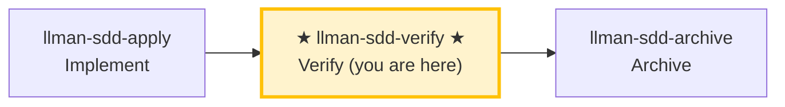

# LLMAN SDD Verify

Use this skill to verify that the implementation matches the change's artifacts.

## Pipeline Position

### Skill navigation (not the lifecycle; shows current skill only)



> 📍 You are in the verify phase → if pass: next `llman-sdd-archive` (archive); if fail: go back to `llman-sdd-apply` (fix). This is Git-native **I (verify)**; the change should already be Specs-landed (`readyToImplement=true`).
> 🗺️ Skill navigation ≠ Git-native lifecycle; see brief lifecycle unit at the bottom.

## Hard Constraints

- **Must pass apply phase all-green first**: don't skip to verify on changes that haven't been implemented.
- **CRITICAL issues must be fixed**: CRITICAL problems must be resolved before archive.
- **Don't ask "should I continue?"**: run the full verification flow, output a complete report.

## Steps
1. Select the change id (or ask the user to pick from `llman sdd list --json`).
## Stage guard (`stage` / `readyToImplement`)

Decide from authoritative JSON (never from vague "complete artifacts" wording):

```bash
llman sdd show <id> --json --type change
```

Read: `stage`, `specsLanded`, `skipSpecsLanding`, `readyToImplement`.

| Condition | Action |
|-----------|--------|
| `stage=draft` (proposal.md only) | STOP. Grow to Designed (proposal + tasks; design as needed) → Branch binding → Specs landing. Draft cannot apply/verify. If proposal+design+tasks exist but stage is still `draft`: not started/attached — run `change start` on a clean default branch, or create a branch then `change attach`. **Do not** create `changes/<id>/specs/`; **do not** edit live specs on the default branch first. |
| `stage=designed` | STOP. Run `change start` / `attach` (Branch binding) first. |
| `stage=full` and `readyToImplement=false` | STOP. Finish Specs landing on the **bound branch** (edit `llmanspec/specs/**` and commit), or set `skip_specs_landing`. **Do not** re-run `change start`. If specs on the bound branch were lost → checkout/recreate + `attach --force` if needed. |
| `readyToImplement=true` | Pass apply/verify prerequisites. `changes/<id>/specs/` is expected to be **absent** — do not treat as missing. |
3. Run a fast validation gate:
   - `llman sdd validate <id> --strict --no-interactive`
   - **When diagnosing structural issues (Gherkin parse / `@req` linkage / dual-write / global req_id uniqueness), prefer adding `--no-check`** (skips the potentially slow `bdd.run_command` under BDD-on); run the full `--check` (full mode) only after structural gates are green. Each `FAIL <item_type>/<id>` line lists a failing item (above the Totals line).
4. Read:
   - Live specs on the feature branch: `llmanspec/specs/**` (`<capability>.feature`) — SSOT
   - `proposal.md` and `design.md` if present
   - `tasks.md` to understand what was implemented
   - `llmanspec/changes/<id>/specs/` only if residual old docs exist — ignore; SSOT is live specs
5. **Dual-axis review (Standards + Spec, kept separate so neither masks the other)** — diff against `git diff <merge-base>...HEAD` (merge-base = the attach base_sha or `main`) on two axes:
   - **Spec axis**: does the implementation satisfy the `@human` rule MUST/SHALL and the `@executable` GWT?
     - Missing/partial behaviors, wrong implementations, and scope creep in the diff not asked for by the spec.
     - Suggest minimal fixes or artifact updates.
   - **Standards axis**: does the code follow `AGENTS.md` coding style + the Fowler smell baseline?
     - **Authority priority**: `AGENTS.md` documented standard > smell baseline (repo overrides); skip anything tooling already enforces.
     - Smells are **judgement heuristics** ("possible Feature Envy"), not hard violations.
     - Smell baseline (each "what → fix"): Mysterious Name (name hides intent → rename) / Duplicated Code (same logic shape → extract shared) / Feature Envy (method uses another's data more → move it) / Data Clumps (same fields travel together → bundle into a type) / Primitive Obsession (primitive stands in for a domain concept → dedicated type) / Repeated Switches (same switch recurs → polymorphism or shared map) / Shotgun Surgery (one change scatters edits → gather into one module) / Divergent Change (one file changes for unrelated reasons → split) / Speculative Generality (abstraction for unseen needs → delete) / Message Chains (long a.b().c() → hide behind one method) / Middle Man (just delegates → cut, call direct) / Refused Bequest (subclass rejects most inheritance → composition).
   - The two axes may be reviewed in parallel (sub-agents); the report MUST present them separately, MUST NOT merge or cross-rerank (one axis passing must not mask the other failing).
6. **BDD-on verification (Git-native Partitioned SSOT)** — only when `config.yaml` has a `bdd:` block:
   - Confirm the change is attached and you are on that feature branch.
   - `llman sdd validate --specs`: Gherkin + `@req`/dual-write gates; runs `bdd.run_command` by default (`--no-check` to skip).
   - Optional read-only review: `llman sdd change diff <id>` (or `--export-patch <path>`). Diff is review/export only — never treat it as an apply step.
   - Check: legacy `spec.toon` / `*.feature.delta.toon` absent; if present, run toon2features first (do not invent a solidify / repair hunt).
   - Next step after verify passes: `llman-sdd-archive` (not inline finalize here).

7. Produce a short report:
   - **CRITICAL** (must fix before archive)
   - **WARNING** (should fix)
   - **SUGGESTION** (nice to have)
8. If CRITICAL exists, suggest `llman-sdd-apply` for fixes. If clean, suggest `llman-sdd-archive` for finalize/archive.

> 💡 Verify pass → next: `llman-sdd-archive` (archive); CRITICAL issues → go back to `llman-sdd-apply` (fix)

## Git-native lifecycle (brief)

Do not conflate **skill navigation** with the **Git-native lifecycle**. Full diagram: root `AGENTS.md` or the diagram inside `llman-sdd-propose`.

Hard rules:
1. **First** Branch binding (`change start` / `attach`) → Full; **then** Specs landing (edit and commit `llmanspec/specs/**` on the bound branch).
2. No live contract edits → `skip_specs_landing: true`. Apply requires `readyToImplement=true`.
3. **Do not** commit live specs on the default branch; if already attached, do not re-run `start`.
Before acting, read `llmanspec/config.yaml` and follow its `context` and `rules` if present.

Common commands:
- `llman sdd context --task "<description>" --paths "<files>"` (find relevant specs). Uses the pageindex agentic tree backend (needs `LLMAN_SDD_INDEX_CHAT_MODEL`). Preset via `LLMAN_SDD_INDEX_BACKEND`.
- `llman sdd list` (list changes)
- `llman sdd list --specs` (list specs with purpose/scope metadata)
- `llman sdd show <id>` (show change/spec; `--type change --output json` includes `stage` / `specsLanded` / `skipSpecsLanding` / `readyToImplement` — apply gate is `readyToImplement`, not vague "complete artifacts")
- `llman sdd validate <id>` (validate a change or spec)
- `llman sdd validate --all` (bulk validate)
- `llman sdd index rebuild` (rebuild the pageindex tree index — no model needed)
- `llman sdd index check` (check index freshness)
- `llman sdd change new <id>` (create planning-shell draft `changes/<id>/proposal.md` only; does not write live specs)
- `llman sdd change start <id> [--worktree]` (Designed→Full: clean tree on default branch → create `sdd/<id>` + attach; Branch binding only — not Specs landing, not apply-ready)
- `llman sdd change attach <id> [--force]` (bind an existing non-default feature branch + base SHA; rejects the default branch)
- `llman sdd change finalize <id> [--no-check]` (**recommended single-commit close-out** — after verify; dirty tree OK; gates + auto ff-merge + docs rename)
- `llman sdd change checkpoint <id> [--no-check]` (clean tree + gates before archive; strict sha = HEAD; finalize fallback)
- `llman sdd change diff <id> [--export-patch <path>]` (read-only `base...HEAD` review/export)
- `llman sdd change archive <id>` (seal: auto ff-merge into default branch, then rename docs to `changes/archive/`; prefer `finalize` for single-commit close-out)
- `llman sdd archive freeze [--before YYYY-MM-DD] [--keep-recent N] [--dry-run]` (freeze archived dirs)
- `llman sdd archive thaw [--change <id> ...] [--dest <path>]` (restore from cold-backup)
- `llman sdd graph [CHANGE] [--format mermaid] [--scope active|archived|all] [--depth N]` (generate change dependency graph)
- `llman sdd project migrate --kind spec-md2toon` (`.md`+fence → standalone `.toon`; `partitioned` removed)

## Context
- Gather the current change/spec state before acting.
- Prefer `llman sdd context --task --paths` to discover relevant specs instead of guessing or full scans.

## Goal
- State the concrete outcome for this command/skill execution.

## Constraints
- Keep changes minimal and scoped.
- Avoid guessing when identifiers or intent are ambiguous.
- Use `llman sdd context --task --paths` before reading full spec files.
- Choose workflow path by change scale: behavioral contracts use full SDD (Branch binding → Specs landing → `readyToImplement` → apply); implementation changes use quick path (live specs still require a bound branch).
- Do not conflate skill navigation with the Git-native lifecycle; never edit live `llmanspec/specs/**` on the default branch.

## Workflow
- Use `llman sdd` commands as the source of truth.
- Validate outcomes when files or specs are updated.
- Prefer `llman sdd context` over full reads or guessing.
- When context is unavailable follow error guidance (rebuild index or fall back to `list --specs --json`).

## Decision Policy
- Ask for clarification when a high-impact ambiguity remains.
- Stop instead of forcing through known validation errors.

## Output Contract
- Summarize actions taken.
- Provide resulting paths and validation status.

## Ethics Governance
- `ethics.risk_level`: classify risk as `low|medium|high|critical`.
- `ethics.prohibited_actions`: list actions that MUST NOT be performed.
- `ethics.required_evidence`: list required evidence before high-impact output.
- `ethics.refusal_contract`: define when to refuse and safe alternative response.
- `ethics.escalation_policy`: define when to escalate to user confirmation/review.
