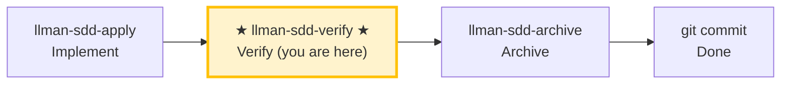

# LLMAN SDD Verify

Use this skill to verify that the implementation matches the change's artifacts.

## Pipeline Position



> 📍 You are in the verify phase → if pass: next `llman-sdd-archive` (archive); if fail: go back to `llman-sdd-apply` (fix)

## Hard Constraints

- **Must pass apply phase all-green first**: don't skip to verify on changes that haven't been implemented.
- **CRITICAL issues must be fixed**: CRITICAL problems must be resolved before archive.
- **Don't ask "should I continue?"**: run the full verification flow, output a complete report.

## Steps
1. Select the change id (or ask the user to pick from `llman sdd list --json`).
2. Check the stage gate (authoritative):
   ```bash
   stage=$(llman sdd show <id> --json --type change | jq -r .stage)
   ```
   (If `jq` is unavailable, parse the `stage` value from the JSON with any tool.)
   - If `stage` is not `full`, the change has nothing implemented to verify → STOP with a guard:
     - `draft`: "Change <id> is a draft proposal (proposal.md only); nothing to verify yet. Generate full artifacts with llman-sdd-propose, then implement with llman-sdd-apply <id>."
     - other non-full (`specified`/`designed`): "Change <id> is in <stage> stage, not ready to verify. Implement first with llman-sdd-apply."
3. Run a fast validation gate:
   - `llman sdd validate <id> --strict --no-interactive`
   - **When diagnosing structural issues (Gherkin parse / `@req` linkage / dual-write / global req_id uniqueness), prefer adding `--no-check`** (skips the potentially slow `bdd.run_command` under BDD-on); run the full `--check` (full mode) only after structural gates are green. Each `FAIL <item_type>/<id>` line lists a failing item (above the Totals line).
4. Read:

   - Delta specs under `llmanspec/changes/<id>/specs/`
   - `proposal.md` and `design.md` if present
   - `tasks.md` to understand what was implemented

5. Compare artifacts vs code:
   - Identify mismatches (missing behavior, wrong behavior, missing tests/docs)
   - Suggest minimal fixes or artifact updates
6. **BDD-on verification (Git-native Partitioned SSOT)** — only when `config.yaml` has a `bdd:` block:
   - Confirm the change is attached and you are on that feature branch.
   - `llman sdd validate --specs`: Gherkin + `@req`/dual-write gates; runs `bdd.run_command` by default (`--no-check` to skip).
   - Optional read-only review: `llman sdd change diff <id>` (or `--export-patch <path>`). Diff is review/export only — never treat it as an apply step.
   - Archive: **prefer** `llman sdd change finalize <id>` (dirty tree OK; then one `git commit`); use `checkpoint` → `archive` only when you need a strict `checkpoint_sha`.
   - Check: executable GWT only in live `.feature`; `morphology.dualWriteCount` should be 0; if an active `*.feature.delta.toon` already exists, migrate first (do not invent a solidify / repair hunt).

7. Produce a short report:
   - **CRITICAL** (must fix before archive)
   - **WARNING** (should fix)
   - **SUGGESTION** (nice to have)
8. If CRITICAL exists, suggest `llman-sdd-apply` for fixes. If clean, suggest archive: `llman sdd change finalize <id>` (recommended) or fallback `checkpoint` + `archive`.

> 💡 Verify pass → next: `llman-sdd-archive` (archive); CRITICAL issues → go back to `llman-sdd-apply` (fix)

Before acting, read `llmanspec/config.yaml` and follow its `context` and `rules` if present.

Common commands:
- `llman sdd context --task "<description>" --paths "<files>"` (find relevant specs). Uses the pageindex agentic tree backend (needs `LLMAN_SDD_INDEX_CHAT_MODEL`). Preset via `LLMAN_SDD_INDEX_BACKEND`.
- `llman sdd list` (list changes)
- `llman sdd list --specs` (list specs with purpose/scope metadata)
- `llman sdd show <id>` (show change/spec)
- `llman sdd validate <id>` (validate a change or spec)
- `llman sdd validate --all` (bulk validate)
- `llman sdd index rebuild` (rebuild the pageindex tree index — no model needed)
- `llman sdd index check` (check index freshness)
- `llman sdd change new <id>` (create draft `changes/<id>/proposal.md`)


- `llman sdd change delta …` (BDD-off only: TOON delta authoring; rejected when BDD-on)

- `llman sdd change archive <id>` (seal a change; BDD-on: docs only after checkpoint / finalize fallback; BDD-off: merge TOON deltas)
- `llman sdd archive freeze [--before YYYY-MM-DD] [--keep-recent N] [--dry-run]` (freeze archived dirs)
- `llman sdd archive thaw [--change <id> ...] [--dest <path>]` (restore from cold-backup)
- `llman sdd graph [CHANGE] [--format mermaid] [--scope active|archived|all] [--depth N]` (generate change dependency graph)
- `llman sdd project migrate [--kind format|partitioned|legacy-bdd|auto]` (one-shot migrations)

## Context
- Gather the current change/spec state before acting.
- Prefer `llman sdd context --task --paths` to discover relevant specs instead of guessing or full scans.

## Goal
- State the concrete outcome for this command/skill execution.

## Constraints
- Keep changes minimal and scoped.
- Avoid guessing when identifiers or intent are ambiguous.
- Use `llman sdd context --task --paths` before reading full spec files.
- Choose workflow path based on change scale: behavioral contract changes use full SDD, implementation changes use quick path.

## Workflow
- Use `llman sdd` commands as the source of truth.
- Validate outcomes when files or specs are updated.
- Prefer `llman sdd context` over full reads or guessing.
- When context is unavailable follow error guidance (rebuild index or fall back to `list --specs --json`).

## Decision Policy
- Ask for clarification when a high-impact ambiguity remains.
- Stop instead of forcing through known validation errors.

## Output Contract
- Summarize actions taken.
- Provide resulting paths and validation status.

## Ethics Governance
- `ethics.risk_level`: classify risk as `low|medium|high|critical`.
- `ethics.prohibited_actions`: list actions that MUST NOT be performed.
- `ethics.required_evidence`: list required evidence before high-impact output.
- `ethics.refusal_contract`: define when to refuse and safe alternative response.
- `ethics.escalation_policy`: define when to escalate to user confirmation/review.
