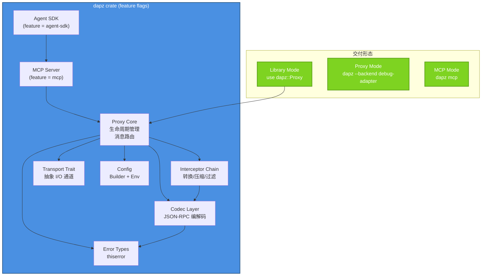
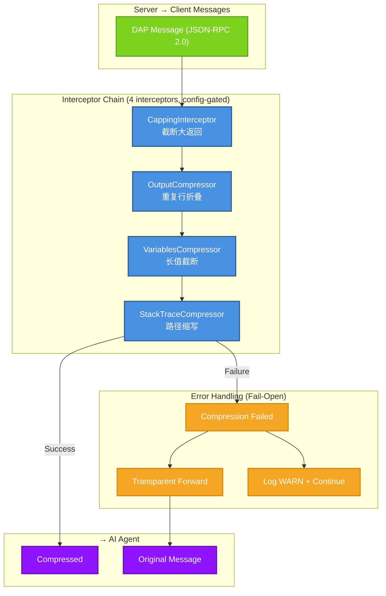
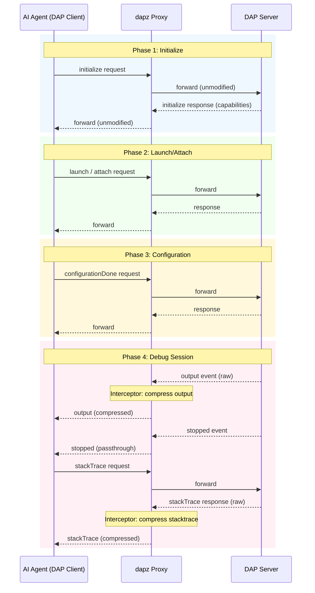

# dapz 三模态架构规格

**版本**: v0.0.1
**状态**: 规划
**最后更新**: 2026-05-12

## 概述

dapz 采用三模态架构设计，支持作为库、DAP 代理、MCP 服务器三种产品形态。

## 架构总览



## 拦截器链架构



## Proxy 状态机

```mermaid
stateDiagram-v2
    [*] --> Created: Proxy::new(config)
    Created --> Initializing: start()
    Initializing --> Ready: configurationDone received
    Ready --> ShuttingDown: disconnect received
    ShuttingDown --> Exited: exit
    Exited --> [*]

    state Ready {
        [*] --> Idle
        Idle --> Forwarding: Client→Server msg
        Forwarding --> Idle
        Idle --> Intercepting: Server→Client msg
        Intercepting --> Compressing: matched interceptor
        Intercepting --> Forwarding: no match
        Compressing --> Idle
        Compressing --> Forwarding: compression failed
    }
```

## DAP 握手流程



## Crate 结构

```
dapz/
├── Cargo.toml           # single crate, feature flags
├── src/
│   ├── lib.rs           # 公共 API + 模块声明
│   ├── main.rs          # CLI 入口 (feature = "cli")
│   ├── proxy.rs         # Proxy 核心状态机 + 消息循环
│   ├── interceptors/    # 所有拦截器实现
│   ├── codec/           # 编解码层（JSON-RPC）
│   ├── transport/       # 传输层实现（stdio, TCP, mock）
│   ├── config.rs        # Config + Builder
│   └── error.rs         # DapzError enum
├── scripts/             # 开发脚本
├── docs/                # 文档
├── benches/             # 基准测试
└── examples/            # 示例代码
```

## 兼容性矩阵

| 功能 | Library | Proxy | MCP |
|------|----------|-------|-----|
| Output 压缩 | ✅ | ✅ | ✅ |
| Variables 压缩 | ✅ | ✅ | ✅ |
| StackTrace 压缩 | ✅ | ✅ | ✅ |
| 自定义传输 | ✅ | ✅ (TCP/WS) | ❌ |
| 运行时配置 | ✅ | ✅ | ⚠️ |
| 多 server | ✅ | ⚠️ | ✅ |
| 零额外开销 | ✅ | ❌ (进程间) | ❌ (MCP 协议) |


## 参考文档

- [ROADMAP.md](../../ROADMAP.md) — 项目路线图
- [AGENTS.md](../../AGENTS.md) — 项目规范 SSOT
- [DAP Specification](https://microsoft.github.io/debug-adapter-protocol/specification)
